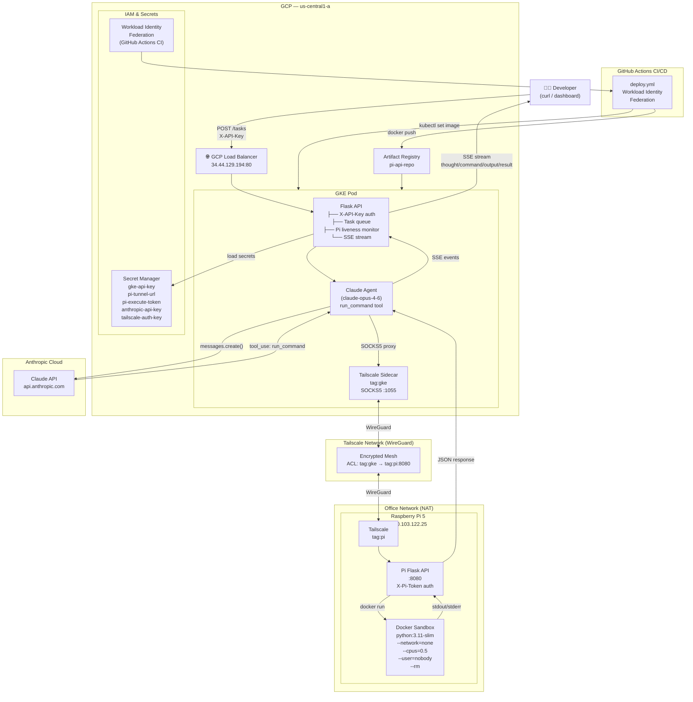
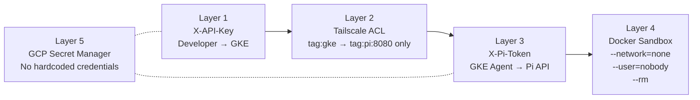
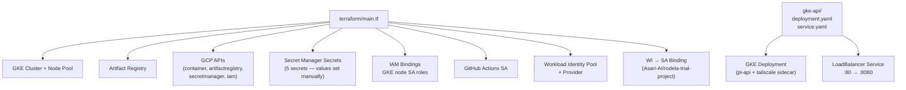

# System Design Architecture

## Overview

A cloud-to-edge AI agent platform. Developers submit natural language tasks via HTTP to a GKE-hosted API. A Claude AI agent interprets the task, executes shell commands on a physical Raspberry Pi 5 through a Tailscale WireGuard mesh, and streams results back in real time.

---

## Architecture Diagram



---

## Request Lifecycle (Sequence)

```mermaid
sequenceDiagram
    participant Dev as Developer
    participant API as GKE Flask API
    participant SM as Secret Manager
    participant Claude as Claude (Anthropic)
    participant TS as Tailscale SOCKS5
    participant Pi as Pi Flask API
    participant Box as Docker Sandbox

    Dev->>API: POST /tasks {description} + X-API-Key
    API->>SM: validate X-API-Key
    SM-->>API: key valid
    API-->>Dev: {task_id, status: queued} 202

    Dev->>API: GET /tasks/{id}/stream (SSE)

    Note over API: Worker thread picks up task

    API-->>Dev: SSE: system — worker started

    loop Agent Loop (max 10 rounds)
        API->>Claude: messages.create(task + tools)
        API-->>Dev: SSE: system — calling Anthropic

        Claude-->>API: tool_use: run_command(cmd)
        API-->>Dev: SSE: system — Anthropic responded
        API-->>Dev: SSE: thought — Claude's reasoning
        API-->>Dev: SSE: command — shell command

        API->>TS: POST via SOCKS5 proxy
        API-->>Dev: SSE: system — routing through Tailscale

        TS->>Pi: POST /execute {command} + X-Pi-Token
        Pi->>Box: docker run --network=none ... sh -c cmd
        Box-->>Pi: stdout/stderr
        Pi-->>TS: {output, exit_code}
        TS-->>API: response

        API-->>Dev: SSE: system — Pi responded
        API-->>Dev: SSE: output — command output

        API->>Claude: tool_result (Pi output)
    end

    Claude-->>API: end_turn + summary
    API-->>Dev: SSE: summary
    API-->>Dev: SSE: status — done
    API-->>Dev: SSE: result — full result object
```

---

## Security Layers



---

## Infrastructure as Code Coverage


